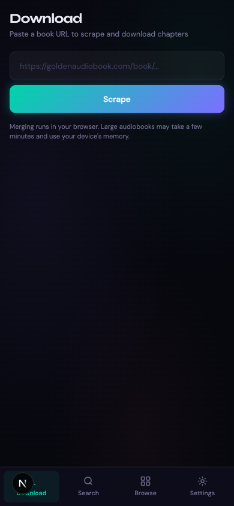
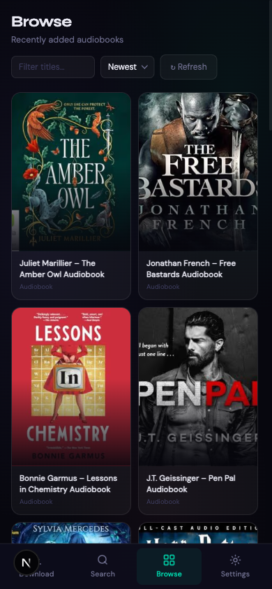
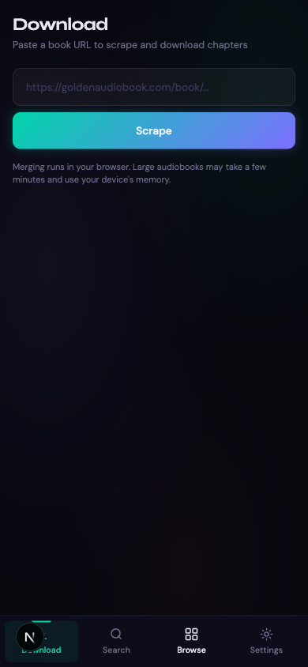

# BookSnag

[](https://nextjs.org)
[](https://www.typescriptlang.org)
[](https://vercel.com)
[](LICENSE)

A free, open-source audiobook downloader for the web. Paste a book URL, scrape its chapters, watch progress, and optionally merge everything into a single `.mp3` — all in the browser.

Web counterpart to the **DownloadIT** macOS app.

<p align="center">
  
  
  
</p>

## Features

- **Download** — Paste a URL, scrape chapters, download 3 in parallel, optionally merge.
- **Search** — Debounced live search across supported sites.
- **Browse** — Recently added audiobooks per source.
- **Book detail** — Synopsis, chapter list, and in-browser preview before downloading.
- **Settings** — Persisted to `localStorage` (merge toggle, default source, etc).

## Supported Sites

| Site                  | Identifier |
| --------------------- | ---------- |
| goldenaudiobook.com   | `golden`   |
| dailyaudiobooks.com   | `daily`    |

## Quick Start

```bash
npm install
npm run dev
```

Open <http://localhost:3000>.

| Script            | Description                  |
| ----------------- | ---------------------------- |
| `npm run dev`     | Dev server (Turbopack)       |
| `npm run build`   | Production build             |
| `npm run start`   | Serve the production build   |
| `npm run lint`    | ESLint                       |

## Stack

Next.js 15 (App Router) · React 19 · TypeScript · Cheerio (server-side scraping) · Tailwind + custom CSS design system · Syne + DM Sans via `next/font/google` · deployed on Vercel.

## How It Works

- **Scraping** runs server-side via Next.js API routes (`/api/scrape`, `/api/browse`, `/api/search`, `/api/book-detail`), using Cheerio against an allowlisted set of domains.
- **Audio streaming** goes through `/api/proxy` to keep requests same-origin.
- **Merging** happens entirely client-side — chapter blobs are concatenated in the browser, so there's no server-side size or timeout limit.
- **Safety** — `src/lib/allowlist.ts` enforces an SSRF-safe domain allowlist; `src/lib/rate-limit.ts` applies a per-IP token bucket.

### Adding a new site

1. Add the domain to `ALLOWED_HOSTS` in `src/lib/allowlist.ts`.
2. Add its image host to `remotePatterns` in `next.config.ts`.

<details>
<summary><strong>Project structure</strong></summary>

```
src/
├── app/
│   ├── layout.tsx          Root layout, SEO metadata, fonts
│   ├── page.tsx            Server shell
│   ├── globals.css         Design system
│   ├── sitemap.ts          Dynamic sitemap
│   ├── robots.ts           Robots.txt
│   └── api/
│       ├── scrape/         Chapter list from a book URL
│       ├── browse/         Recent books for a site
│       ├── search/         Search a site
│       ├── book-detail/    Synopsis, chapters, cover
│       └── proxy/          Same-origin audio proxy
├── lib/
│   ├── allowlist.ts        SSRF-safe URL validation
│   └── rate-limit.ts       Per-IP token bucket
└── components/
    └── BookSnagApp.tsx     Single client component, all tab logic
```

</details>

## Deployment

Push to GitHub → import the repo in Vercel → it deploys on every push to `main`. No `vercel.json` required.

When the production domain is confirmed, update the `siteUrl` constant in `src/app/layout.tsx`, `src/app/sitemap.ts`, and `src/app/robots.ts`.

## Legal

BookSnag is a client for publicly accessible audiobook sites. It does **not** host, distribute, or redistribute audio content. Users are responsible for complying with the terms of service of the underlying sites and with copyright law in their jurisdiction.

See the in-app [Disclaimer](src/app/disclaimer/page.tsx) for the full statement.

## Contributing

See [CONTRIBUTING.md](CONTRIBUTING.md) and [CODE_OF_CONDUCT.md](CODE_OF_CONDUCT.md).

## License

[WTFPL](LICENSE).
